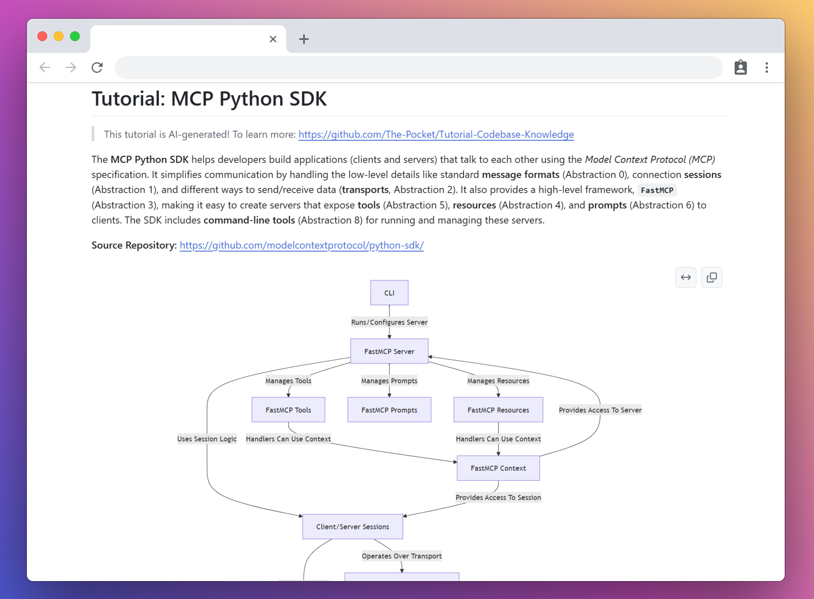
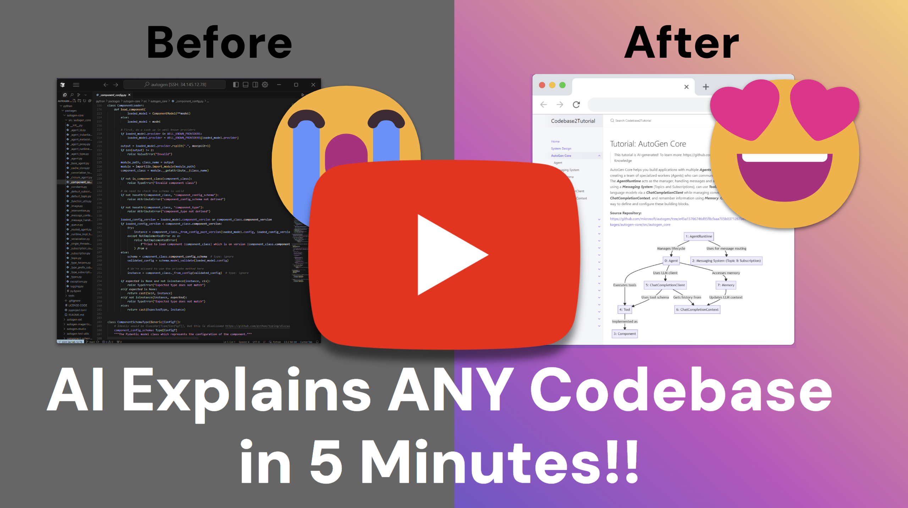

<h1 align="center">Turns Codebase into Technical Documentation with AI</h1>


 <a href="https://discord.gg/hUHHE9Sa6T">
    
</a>
> *Ever stared at a complex codebase and wished you had comprehensive technical documentation? This tool analyzes GitHub repositories and creates detailed technical documentation explaining the architecture, endpoints, libraries, and implementation details.*

<p align="center">
  
</p>

This is a tutorial project of [Pocket Flow](https://github.com/The-Pocket/PocketFlow), a 100-line LLM framework. It crawls GitHub repositories and builds comprehensive technical documentation from the code. It analyzes entire codebases to identify core technical components, architecture patterns, API endpoints, and implementation details, transforming complex code into detailed technical documentation with clear visualizations.

- Check out the [YouTube Development Tutorial](https://youtu.be/AFY67zOpbSo) for more!

- Check out the [Substack Post Tutorial](https://zacharyhuang.substack.com/p/ai-codebase-knowledge-builder-full) for more!

&nbsp;&nbsp;**🔸 🎉 Reached Hacker News Front Page** (April 2025) with >900 up‑votes:  [Discussion »](https://news.ycombinator.com/item?id=43739456)

&nbsp;&nbsp;**🔸 🎊 Online Service Now Live!** (May&nbsp;2025) Try our new online version at [https://code2tutorial.com/](https://code2tutorial.com/) – just paste a GitHub link, no installation needed!

## ⭐ Example Results for Popular GitHub Repositories!

<p align="center">
    
</p>

🤯 All these technical documentation sets are generated **entirely by AI** by crawling the GitHub repo!

- [AutoGen Core](https://the-pocket.github.io/PocketFlow-Tutorial-Codebase-Knowledge/AutoGen%20Core) - Technical documentation for building AI teams that talk, think, and solve problems together!

- [Browser Use](https://the-pocket.github.io/PocketFlow-Tutorial-Codebase-Knowledge/Browser%20Use) - Technical documentation for AI web automation, clicking buttons and filling forms like a digital assistant!

- [Celery](https://the-pocket.github.io/PocketFlow-Tutorial-Codebase-Knowledge/Celery) - Technical documentation for background task processing and distributed task queues!

- [Click](https://the-pocket.github.io/PocketFlow-Tutorial-Codebase-Knowledge/Click) - Technical documentation for building command-line interfaces with Python decorators!

- [Codex](https://the-pocket.github.io/PocketFlow-Tutorial-Codebase-Knowledge/Codex) - Technical documentation for AI-powered code generation and terminal automation!

- [Crawl4AI](https://the-pocket.github.io/PocketFlow-Tutorial-Codebase-Knowledge/Crawl4AI) - Technical documentation for web scraping and data extraction with AI!

- [CrewAI](https://the-pocket.github.io/PocketFlow-Tutorial-Codebase-Knowledge/CrewAI) - Technical documentation for multi-agent AI systems and collaborative problem solving!

- [DSPy](https://the-pocket.github.io/PocketFlow-Tutorial-Codebase-Knowledge/DSPy) - Technical documentation for declarative LLM programming and optimization!

- [FastAPI](https://the-pocket.github.io/PocketFlow-Tutorial-Codebase-Knowledge/FastAPI) - Technical documentation for high-performance API development with automatic documentation!

- [Flask](https://the-pocket.github.io/PocketFlow-Tutorial-Codebase-Knowledge/Flask) - Technical documentation for lightweight web application development!

- [Google A2A](https://the-pocket.github.io/PocketFlow-Tutorial-Codebase-Knowledge/Google%20A2A) - Technical documentation for universal agent communication protocols!

- [LangGraph](https://the-pocket.github.io/PocketFlow-Tutorial-Codebase-Knowledge/LangGraph) - Technical documentation for building stateful AI applications with graph-based workflows!

- [LevelDB](https://the-pocket.github.io/PocketFlow-Tutorial-Codebase-Knowledge/LevelDB) - Technical documentation for high-performance key-value storage systems!

- [MCP Python SDK](https://the-pocket.github.io/PocketFlow-Tutorial-Codebase-Knowledge/MCP%20Python%20SDK) - Technical documentation for Model Context Protocol implementation!

- [NumPy Core](https://the-pocket.github.io/PocketFlow-Tutorial-Codebase-Knowledge/NumPy%20Core) - Technical documentation for numerical computing and array operations!

- [OpenManus](https://the-pocket.github.io/PocketFlow-Tutorial-Codebase-Knowledge/OpenManus) - Technical documentation for AI agent development with digital reasoning!

- [PocketFlow](https://the-pocket.github.io/PocketFlow-Tutorial-Codebase-Knowledge/PocketFlow) - Technical documentation for the 100-line LLM framework!

- [Pydantic Core](https://the-pocket.github.io/PocketFlow-Tutorial-Codebase-Knowledge/Pydantic%20Core) - Technical documentation for data validation and serialization!

- [Requests](https://the-pocket.github.io/PocketFlow-Tutorial-Codebase-Knowledge/Requests) - Technical documentation for HTTP library and web communication!

- [SmolaAgents](https://the-pocket.github.io/PocketFlow-Tutorial-Codebase-Knowledge/SmolaAgents) - Technical documentation for lightweight AI agent frameworks!

- Showcase Your AI-Generated Technical Documentation in [Discussions](https://github.com/The-Pocket/PocketFlow-Tutorial-Codebase-Knowledge/discussions)!

## 🚀 Getting Started

1. Clone this repository
   ```bash
   git clone https://github.com/The-Pocket/PocketFlow-Tutorial-Codebase-Knowledge
   ```

3. Install dependencies:
   ```bash
   pip install -r requirements.txt
   ```

4. Set up LLM in [`utils/call_llm.py`](./utils/call_llm.py) by providing credentials. The system now supports multiple LLM providers:

   **Google Gemini (Default):**
   ```bash
   export GEMINI_API_KEY="your-api-key"
   export GEMINI_MODEL="gemini-pro"  # or "gemini-2.0-flash-exp"
   ```

   **OpenAI:**
   ```bash
   export OPENAI_API_KEY="your-api-key"
   export OPENAI_MODEL="gpt-4"  # or "gpt-4o", "o1"
   ```

   **Anthropic Claude:**
   ```bash
   export ANTHROPIC_API_KEY="your-api-key"
   export ANTHROPIC_MODEL="claude-3-sonnet-20240229"  # or "claude-3-5-sonnet-20241022"
   ```

   **Ollama (Local):**
   ```bash
   export OLLAMA_HOST="http://localhost:11434"
   export OLLAMA_MODEL="llama-3.2-3b-instruct"
   ```

   **Enterprise/Apigee:**
   ```bash
   # For Apigee
   export APIGEE_NONPROD_LOGIN_URL="your-login-url"
   export APIGEE_CONSUMER_KEY="your-consumer-key"
   export APIGEE_CONSUMER_SECRET="your-consumer-secret"
   export ENTERPRISE_BASE_URL="your-base-url"
   export WF_USE_CASE_ID="your-use-case-id"
   export WF_CLIENT_ID="your-client-id"
   export WF_API_KEY="your-api-key"
   
   # For Enterprise
   export ENTERPRISE_LLM_URL="your-llm-url"
   export ENTERPRISE_LLM_TOKEN="your-token"
   ```

   The system will automatically select the best available provider based on your environment variables. You can verify that it is correctly set up by running:
   ```bash
   python utils/call_llm.py
   ```

5. Generate comprehensive technical documentation by running the main script:
    ```bash
    # Analyze a GitHub repository
    python main.py --repo https://github.com/username/repo --include "*.py" "*.js" --exclude "tests/*" --max-size 50000

    # Or, analyze a specific branch
    python main.py --repo https://github.com/username/repo --branch develop --include "*.py"

    # Or, analyze a local directory
    python main.py --dir /path/to/your/codebase --include "*.py" --exclude "*test*"

    # Or, generate technical documentation in Chinese from a specific branch
    python main.py --repo https://github.com/username/repo --branch feature/new-api --language "Chinese"
    
    # Or, generate HTML documentation instead of Markdown
    python main.py --repo https://github.com/username/repo --format html
    
    # Or, generate HTML documentation in Chinese
    python main.py --repo https://github.com/username/repo --format html --language Chinese
    
    # Or, set a custom timeout for LLM calls (15 minutes)
    python main.py --repo https://github.com/username/repo --timeout 900
    
    # Or, use environment variable for timeout
    OPENAI_TIMEOUT=1200 python main.py --repo https://github.com/username/repo
    ```

    - `--repo` or `--dir` - Specify either a GitHub repo URL or a local directory path (required, mutually exclusive)
    - `-n, --name` - Project name (optional, derived from URL/directory if omitted)
    - `-t, --token` - GitHub token (or set GITHUB_TOKEN environment variable)
    - `-b, --branch` - Git branch to clone (default: "main")
    - `-o, --output` - Output directory (default: ./output)
    - `-i, --include` - Files to include (e.g., "`*.py`" "`*.js`")
    - `-e, --exclude` - Files to exclude (e.g., "`tests/*`" "`docs/*`")
    - `-s, --max-size` - Maximum file size in bytes (default: 100KB)
    - `--language` - Language for the generated documentation (default: "english")
    - `--format` - Output format for documentation: "markdown" or "html" (default: "markdown")
    - `--max-abstractions` - Maximum number of technical components to identify (default: 10)
    - `--timeout` - LLM timeout in seconds (default: 600, 10 minutes)
    - `--no-cache` - Disable LLM response caching (default: caching enabled)

The application will crawl the repository, analyze the codebase architecture, identify technical components, generate comprehensive technical documentation in the specified language, and save the output in the specified directory (default: ./output).


<details>
 
<summary> 🐳 <b>Running with Docker</b> </summary>

To run this project in a Docker container, you'll need to pass your API keys as environment variables. 

1. Build the Docker image
   ```bash
   docker build -t pocketflow-app .
   ```

2. Run the container

   You'll need to provide your LLM API key for the system to function. The system supports multiple providers and will automatically select the best available one based on your environment variables.
   
   Mount a local directory to `/app/output` inside the container to access the generated tutorials on your host machine.
   
   **Example for analyzing a public GitHub repository with Gemini:**
   
   ```bash
   docker run -it --rm \
     -e GEMINI_API_KEY="YOUR_GEMINI_API_KEY_HERE" \
     -v "$(pwd)/output_tutorials":/app/output \
     pocketflow-app --repo https://github.com/username/repo
   ```
   
   **Example for analyzing a local directory with OpenAI:**
   
   ```bash
   docker run -it --rm \
     -e OPENAI_API_KEY="YOUR_OPENAI_API_KEY_HERE" \
     -e OPENAI_MODEL="gpt-4" \
     -v "/path/to/your/local_codebase":/app/code_to_analyze \
     -v "$(pwd)/output_tutorials":/app/output \
     pocketflow-app --dir /app/code_to_analyze
   ```
   
   **Example for analyzing with Anthropic Claude:**
   
   ```bash
   docker run -it --rm \
     -e ANTHROPIC_API_KEY="YOUR_ANTHROPIC_API_KEY_HERE" \
     -e ANTHROPIC_MODEL="claude-3-sonnet-20240229" \
     -v "$(pwd)/output_tutorials":/app/output \
     pocketflow-app --repo https://github.com/username/repo
   ```
   
   **Example for analyzing with local Ollama:**
   
   ```bash
   docker run -it --rm \
     -e OLLAMA_HOST="http://host.docker.internal:11434" \
     -e OLLAMA_MODEL="llama-3.2-3b-instruct" \
     -v "$(pwd)/output_tutorials":/app/output \
     pocketflow-app --repo https://github.com/username/repo
   ```
   
   If you're analyzing private GitHub repositories or want to avoid rate limits, also provide your `GITHUB_TOKEN`:
   
   ```bash
   docker run -it --rm \
     -e GEMINI_API_KEY="YOUR_GEMINI_API_KEY_HERE" \
     -e GITHUB_TOKEN="YOUR_GITHUB_TOKEN_HERE" \
     -v "$(pwd)/output_tutorials":/app/output \
     pocketflow-app --repo https://github.com/username/private-repo
   ```
   
   **For GitHub Enterprise environments:**
   
   ```bash
   docker run -it --rm \
     -e GEMINI_API_KEY="YOUR_GEMINI_API_KEY_HERE" \
     -e GITHUB_TOKEN="YOUR_ENTERPRISE_TOKEN_HERE" \
     -e GITHUB_ENTERPRISE_DISABLE_SSL="true" \
     -v "$(pwd)/output_tutorials":/app/output \
     pocketflow-app --repo https://github.company.com/username/repo
   ```
</details>

## 🏢 Enterprise Support

The system now includes comprehensive enterprise support for GitHub Enterprise and other enterprise environments:

### GitHub Enterprise Configuration

For GitHub Enterprise environments, you can configure SSL and authentication settings:

```bash
# Disable SSL verification (common in enterprise environments)
export GITHUB_ENTERPRISE_DISABLE_SSL=true

# Use custom CA bundle for SSL verification
export GITHUB_ENTERPRISE_CA_BUNDLE=/path/to/ca-bundle.pem

# GitHub token for authentication
export GITHUB_TOKEN=your-github-token
```

### Enhanced Repository Handling

The system automatically:
- **Detects Enterprise URLs**: Any GitHub hostname other than `github.com`
- **Smart Method Selection**: Uses API first for enterprise (better for VPN/proxy), Git clone first for public repos
- **SSL Certificate Handling**: Supports self-signed certificates and custom CA bundles
- **Error Recovery**: Automatic retry with different SSL settings
- **Resource Management**: Automatic cleanup of temporary repositories

### Enterprise Environment Variables

| Variable | Description | Default |
|----------|-------------|---------|
| `GITHUB_ENTERPRISE_DISABLE_SSL` | Disable SSL verification for enterprise | `false` |
| `GITHUB_ENTERPRISE_CA_BUNDLE` | Path to custom CA bundle | None |
| `GITHUB_TOKEN` | GitHub token for authentication | None |

## 🧪 Testing

You can test the system components individually:

```bash
# Test LLM client
python test_llm_client.py

# Test Git operations
python test_git_operations.py

# Test the complete system
python main.py --repo https://github.com/octocat/Hello-World --include "*.md" --max-size 10000
```

## 💡 Development Tutorial

- I built using [**Agentic Coding**](https://zacharyhuang.substack.com/p/agentic-coding-the-most-fun-way-to), the fastest development paradigm, where humans simply [design](docs/design.md) and agents [code](flow.py).

- The secret weapon is [Pocket Flow](https://github.com/The-Pocket/PocketFlow), a 100-line LLM framework that lets Agents (e.g., Cursor AI) build for you

- Check out the Step-by-step YouTube development tutorial:

<br>
<div align="center">
  <a href="https://youtu.be/AFY67zOpbSo" target="_blank">
    
  </a>
</div>
<br>


